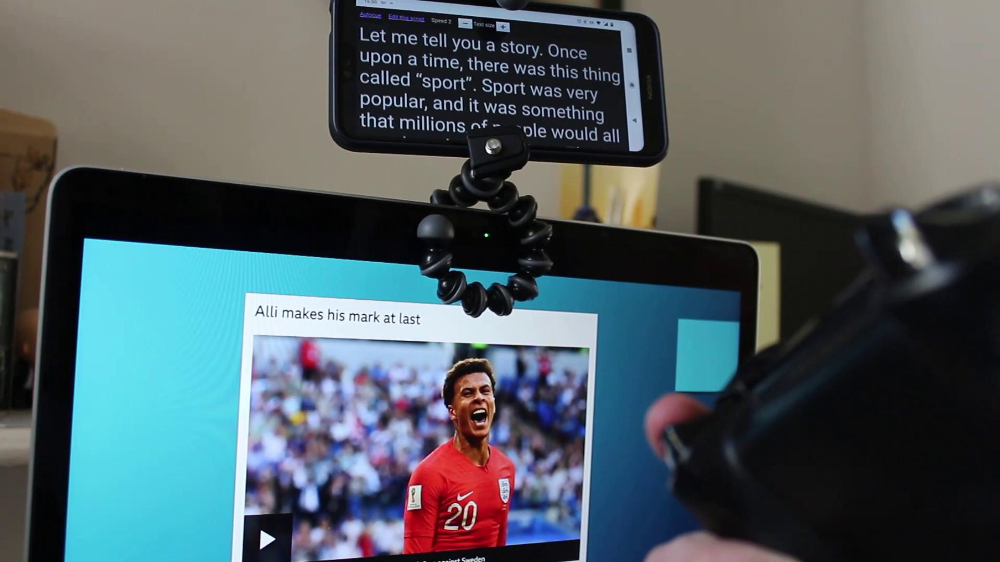

# Autocue

Don't have time to learn what you have to say in a presentation? Use an autocue!



To use it, go to https://autocue.dpope.uk on any device, and click "Create a new script". Paste your script into the box and hit "Save". Your script will be given a unique ID which you can then open with your phone.

Pair an Xbox controller with your phone using Bluetooth, then visit your script's link. You can also type the script's ID into the https://autocue.dpope.uk homepage if that's easier.

Attach your phone to the top of your laptop screen. I've used a Gorillapod. Get creative!

Then you can use the right trigger on the Xbox controller to scroll through your script. The left trigger will scroll the other way. Varying pressure on the trigger should change the scrolling speed, though this seems to only work with Chrome on Android.

Note that this service stores scripts centrally in plain text. Feel free to host this service on your own hardware.

## To run yourself

Using Docker is the fastest way to get started. If you have docker-compose installed, run `docker-compose build` from the root directory, then `docker-compose up`. The service will be running on port 8000, using the database stored in data/data.db (so a restart will not lose the data).

Alternatively, you're going to need Python 3.7 and `pipenv` installed. Install dependencies using `pipenv install` and run with `pipenv run gunicorn --bind 0.0.0.0:8000 app:app`. That will also run on port 8000.

## Initialise the database

If the classes in `app.py` change, you will need to adjust the database's structure to match. One way to do this is to delete the previous database and start again from scratch.

In a terminal, run the following:
```bash
pipenv run python
```

Then at the Python prompt:
```python
from app import db
db.create_all()
exit()
```
